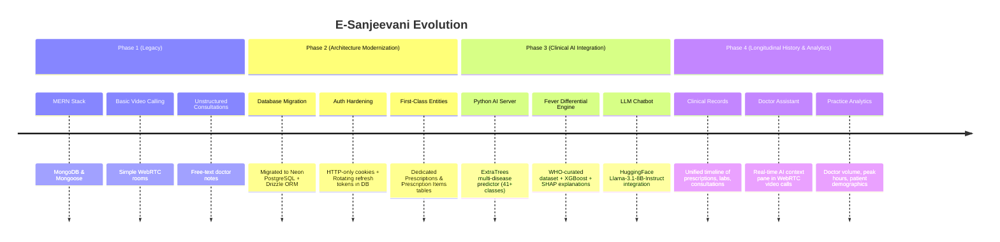
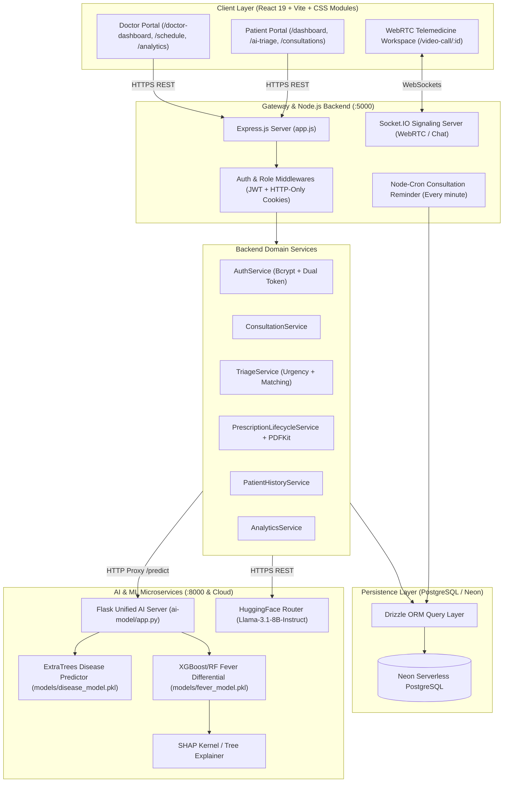
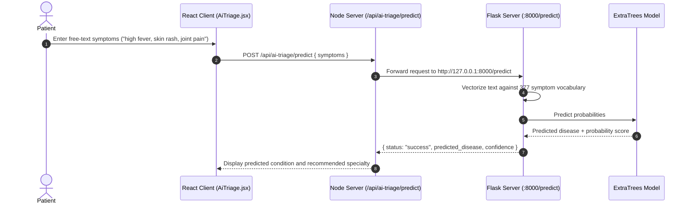
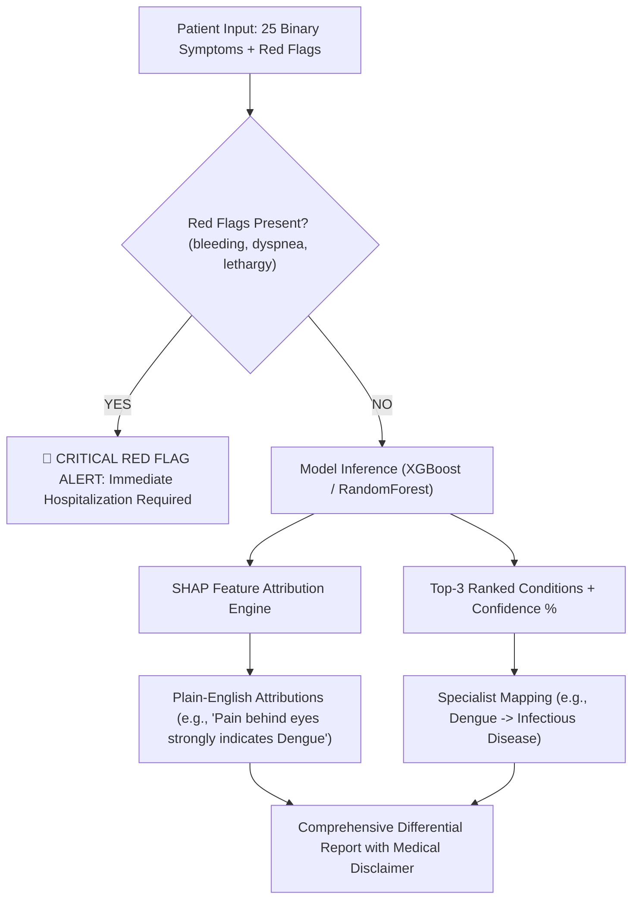
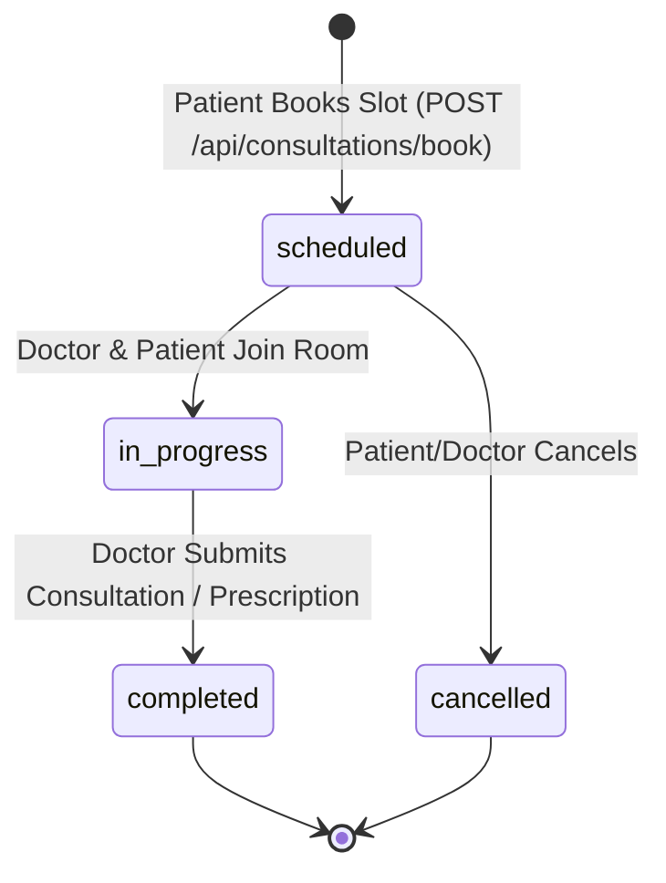
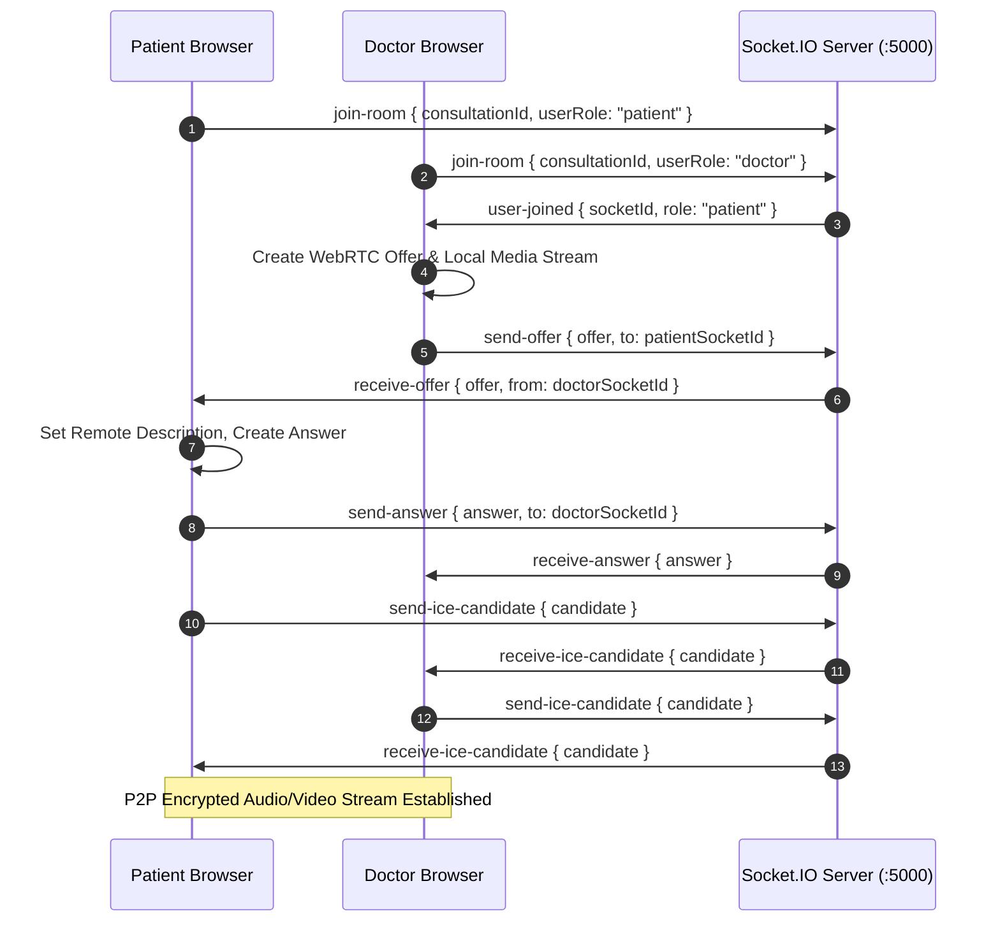
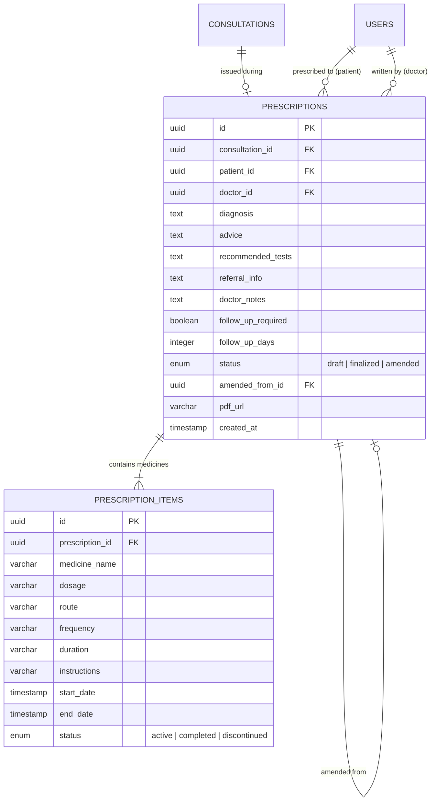
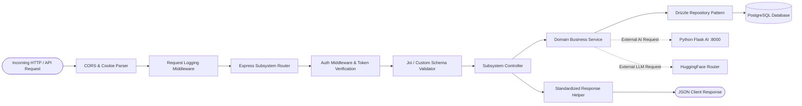
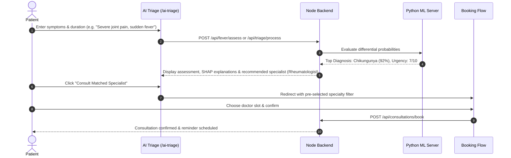

# E-Sanjeevani 2.0 — Comprehensive Project Context & Architecture Master Document

> **Document Purpose**: This single master document captures the complete technical context, architecture, schemas, ML models, APIs, user workflows, research paper alignment, and development rules for **E-Sanjeevani 2.0**. Any AI coding agent or engineer reading this file possesses 100% of the information required to develop, debug, and extend this project without needing external guidance or prior chat history.
>
> **Last Repository Audit**: May 2026 / Local Workspace Audit
> **Repository Grounding**: 100% verified against active repository code in `client/`, `server/`, `ai-model/`, and `database/`.

---

## Table of Contents

1. [Project Identity & Core Vision](#1-project-identity--core-vision)
2. [Project History & Architectural Evolution](#2-project-history--architectural-evolution)
3. [Master Feature Inventory & Implementation Status](#3-master-feature-inventory--implementation-status)
4. [System Architecture & Data Flow](#4-system-architecture--data-flow)
5. [AI & Machine Learning Subsystems](#5-ai--machine-learning-subsystems)
   - [A. General Disease Predictor Model](#a-general-disease-predictor-model)
   - [B. Fever Differential Assessment & Explainable ML (SHAP)](#b-fever-differential-assessment--explainable-ml-shap)
   - [C. Rule-Based Urgency Scoring & Smart Triage](#c-rule-based-urgency-scoring--smart-triage)
   - [D. Conversational AI Chatbot (LLM Integration)](#d-conversational-ai-chatbot-llm-integration)
   - [E. In-Consultation Doctor Clinical Assistant](#e-in-consultation-doctor-clinical-assistant)
6. [Doctor Matching & Dynamic Prioritization Algorithm](#6-doctor-matching--dynamic-prioritization-algorithm)
7. [Appointment & Consultation Management System](#7-appointment--consultation-management-system)
8. [Telemedicine Video Consultation & WebRTC Subsystem](#8-telemedicine-video-consultation--webrtc-subsystem)
9. [Longitudinal Patient Records & Clinical History](#9-longitudinal-patient-records--clinical-history)
10. [Prescription Management Subsystem (First-Class Clinical Entity)](#10-prescription-management-subsystem-first-class-clinical-entity)
11. [Database Architecture & Drizzle Schema Reference](#11-database-architecture--drizzle-schema-reference)
12. [Backend Architecture & Request Lifecycle](#12-backend-architecture--request-lifecycle)
13. [Comprehensive REST & WebSocket API Inventory](#13-comprehensive-rest--websocket-api-inventory)
14. [Frontend Architecture & Component/Page Map](#14-frontend-architecture--componentpage-map)
15. [End-to-End User Journeys & Workflows](#15-end-to-end-user-journeys--workflows)
16. [File & Directory Map](#16-file--directory-map)
17. [Important Classes, Services & Functions](#17-important-classes-services--functions)
18. [Research Paper Alignment & Academic Gaps](#18-research-paper-alignment--academic-gaps)
19. [Security, Authentication & Data Protection](#19-security-authentication--data-protection)
20. [Testing, Environment Setup & Deployment](#20-testing-environment-setup--deployment)
21. [Medical Safety, Ethical Scope & Limitations](#21-medical-safety-ethical-scope--limitations)
22. [Current Development Status, Known Bugs & Technical Debt](#22-current-development-status-known-bugs--technical-debt)
23. [Future Project Roadmap](#23-future-project-roadmap)
24. [Instructions for Future AI Coding Agents](#24-instructions-for-future-ai-coding-agents)
25. [Quick Context for Future AI Agents (TL;DR)](#25-quick-context-for-future-ai-agents-tldr)

---

## 1. Project Identity & Core Vision

### 1.1 Project Name
**E-Sanjeevani 2.0** (Next-Generation AI-Augmented Telemedicine & Clinical Triage Platform)

### 1.2 Project Type
Full-stack, multi-tier healthcare application integrating:
- React Single Page Application (SPA) with responsive clinical design.
- Node.js / Express.js REST API with WebSocket WebRTC signaling.
- Serverless PostgreSQL database with Drizzle ORM.
- Python Flask Microservice providing Classical ML (ExtraTrees), XGBoost, and SHAP explainability.
- Large Language Model (LLM) clinical conversation interface via HuggingFace Router (`Llama-3.1-8B-Instruct`).

### 1.3 Core Problem Statement
Traditional telemedicine systems (including legacy First-Come-First-Serve queues) suffer from severe limitations:
1. **Inefficient Triage & Queuing**: Critical emergencies wait behind routine checkups.
2. **Doctor Overload**: Physicians spend excessive time fielding repetitive, non-critical questions that could be triaged automatically.
3. **Fragmented Patient History**: Consultations happen in isolation without immediate access to longitudinal diagnostic trends, prior medication courses, or allergy profiles.
4. **Diagnostic Ambiguity in Vector-Borne & Febrile Illnesses**: Fever cases (Dengue, Malaria, Typhoid, Chikungunya, Viral Fever) share high symptom overlap, leading to misdiagnosis or delayed specialist assignment.
5. **Prescription Fragility**: Unstructured doctor notes lead to lost medication history and unclear active/inactive medication timelines.

### 1.4 Objectives
- **Intelligent Triage**: Automate severity calculation (1–10 scale) using clinical keyword heuristics and ML prediction before consultation.
- **Smart Doctor Matching**: Replace FIFO queues with a 5-factor weighted matching algorithm ($40\%$ Urgency, $25\%$ Specialty, $20\%$ Availability, $10\%$ Language, $5\%$ Experience).
- **Dual-Path Architecture**: Path A (Knowledge & Self-Care AI) vs Path B (Clinical Escalation & Specialist Routing).
- **Explainable Fever Differential Assessment**: Assist clinicians with ranked probabilistic fever disease predictions backed by feature-level SHAP attributions and red-flag alerts.
- **Structured Longitudinal Clinical Records**: Centralize immutable finalized prescriptions, duration-aware medication tracking, laboratory uploads, and consultation analytics into a unified patient timeline.

### 1.5 Target User Roles
- **Patient**: End-user seeking medical guidance, AI triage, doctor consultations, appointment scheduling, prescription tracking, and personal medical record viewing.
- **Doctor / Physician**: Licensed practitioner managing availability slots, reviewing pending consultations, conducting WebRTC video/audio sessions, viewing longitudinal patient records, querying in-call AI clinical assistant, issuing structured digital prescriptions (with PDF generation), and reviewing practice analytics.
- **Administrator** *(schema supported)*: System management and doctor verification.

---

## 2. Project History & Architectural Evolution



### 2.1 Evolution Milestones
1. **Database Migration**: Replaced legacy MongoDB/Mongoose with Neon Serverless PostgreSQL and Drizzle ORM. Full relational normalization established for users, doctor profiles, availability slots, consultations, prescriptions, and triage sessions.
2. **Security & Auth Overhaul**: Implemented dual-token authentication using short-lived JWTs (15 min) and database-persisted rotating refresh tokens (7 days) with HTTP-only cookies.
3. **Prescription Refactoring**: Elevated prescriptions from free-text fields inside consultations into an immutable, versioned first-class entity with duration-computed active/completed medication statuses and server-side PDFKit generation.
4. **Unified Python AI Server**: Consolidated standalone scripts into a single lazy-loaded Flask microservice (`ai-model/app.py`) serving both General Disease Prediction (`/predict`) and Fever Differential Assessment (`/predict-fever`) on port 8000.

---

## 3. Master Feature Inventory & Implementation Status

| Subsystem / Feature | User Role | Status | Frontend Implementation | Backend Implementation | Database Schema | ML / AI Layer |
| :--- | :--- | :--- | :--- | :--- | :--- | :--- |
| **User Authentication & RBAC** | All | ✅ Fully Implemented | `client/src/pages/Auth/Auth.jsx`, `useAuthGuard.js` | `authController.js`, `auth.service.js`, `authMiddleware.js` | `users`, `refreshTokens` | N/A |
| **Patient Profile Setup** | Patient | ✅ Fully Implemented | `ProfileCompletion.jsx` | `patientProfileController.js`, `patientProfile.service.js` | `patientProfiles`, `patientAddresses` | N/A |
| **Doctor Profile Setup & Edit** | Doctor | ✅ Fully Implemented | `DoctorProfileSetup.jsx`, `DoctorProfileEdit.jsx` | `doctorProfileController.js`, `doctorProfile.service.js` | `doctorProfiles` | N/A |
| **Doctor Availability Management** | Doctor | ✅ Fully Implemented | `DoctorSchedule.jsx` | `doctorAvailabilityController.js`, `availability.service.js` | `doctorAvailabilities`, `availabilitySlots` | N/A |
| **Doctor Discovery & Search** | Patient | ✅ Fully Implemented | `AvailableDoctors.jsx`, `ConsultationBookingForm.jsx` | `consultationController.js`, `consultation.service.js` | `doctorProfiles`, `availabilitySlots`, `users` | N/A |
| **Appointment Booking Workflow** | Patient | ✅ Fully Implemented | `ConsultationBookingForm.jsx` | `consultationController.js`, `consultation.service.js` | `consultations` | Optional triage auto-match |
| **Patient Dashboard** | Patient | ✅ Fully Implemented | `PatientDashBoard.jsx` | `consultationController.js`, `patientProfileController.js` | `consultations`, `patientProfiles` | Triage card integration |
| **Doctor Dashboard** | Doctor | ✅ Fully Implemented | `DoctorDashboard.jsx` | `consultationController.js`, `doctorProfileController.js` | `consultations`, `doctorProfiles` | Urgent consultation badges |
| **WebRTC Video Consultation** | Patient, Doctor | ✅ Fully Implemented | `VideoCall.jsx` (WebRTC + Canvas/Media) | `socketServer.js` (Signaling), `consultationController.js` | `consultations`, `chatMessages` | In-call AI Assistant |
| **In-Consultation Text Chat** | Patient, Doctor | ✅ Fully Implemented | `VideoCall.jsx` | `chatController.js`, `chat.service.js` | `chatMessages` | N/A |
| **Consultation Email Reminders** | System | ✅ Fully Implemented | UI Notification Service | `cron/consultationReminderJob.js`, `emails/` | `consultations` | N/A |
| **General Disease Predictor** | Patient | ✅ Fully Implemented | `AiTriage.jsx` | `aiTriageController.js`, `aiTriageClient.js` | `aiTriageChats` | `ai-model/app.py` (`/predict`, ExtraTrees) |
| **Fever Differential Assessment** | Patient, Doctor | ✅ Fully Implemented | `AiTriage.jsx` (API proxy ready) | `routes/feverRoutes.js` | `triageSessions`, `triageMessages` | `ai-model/app.py` (`/predict-fever`, RF/XGBoost + SHAP) |
| **Rule-Based Triage & Urgency** | Patient | ✅ Fully Implemented | `AiTriage.jsx`, `TriageHistory.jsx`, `TriageDetailView.jsx` | `triageController.js`, `triage.service.js`, `urgencyScoring.js` | `triageSessions`, `triageResponses`, `triageMessages` | Heuristic scoring (1-10) |
| **Smart Doctor Match Algorithm** | System | ✅ Fully Implemented | `AiTriage.jsx` | `doctorMatching.js` | `doctorProfiles`, `availabilitySlots` | 5-Factor weighted formula |
| **Conversational AI Chatbot** | Patient | ✅ Fully Implemented | Integrated via `/api/chat` | `chatController.js`, `chat.service.js` | `triageMessages` | `Llama-3.1-8B-Instruct` via HuggingFace API |
| **In-Call Doctor AI Assistant** | Doctor | ✅ Fully Implemented | `VideoCall.jsx` (Clinical Workspace) | `doctorAssistantController.js`, `doctorAssistant.service.js` | `consultations`, `patientProfiles`, `aiTriageChats` | Summary extraction |
| **Prescription Issuance & Amendment** | Doctor | ✅ Fully Implemented | `VideoCall.jsx` (Clinical Tab) | `prescriptionController.js`, `prescriptionLifecycle.service.js` | `prescriptions`, `prescriptionItems` | N/A |
| **Prescription PDF Generation** | Patient, Doctor | ✅ Fully Implemented | View/Download in `ClinicalRecords.jsx`, `VideoCall.jsx` | `prescriptionPdfService.js` (PDFKit) | `prescriptions` (`pdfUrl`) | N/A |
| **Longitudinal Patient History** | Patient, Doctor | ✅ Fully Implemented | `PatientHistory.jsx`, `DoctorPatientHistory.jsx` | `patientHistoryController.js`, `patientHistory.service.js` | `consultations`, `prescriptions`, `medicalRecords` | Factual consultation metrics |
| **Patient Document Uploads** | Patient | ✅ Fully Implemented | `ClinicalRecords.jsx`, `AddPreviousRecordModal.jsx` | `medicalRecordController.js`, `medicalRecord.service.js` | `medicalRecords`, `medicalRecordAttachments` | Multipart file upload |
| **Doctor Practice Analytics** | Doctor | ✅ Fully Implemented | `DoctorAnalytics.jsx` | `analytics.controller.js`, `analytics.service.js` | `consultations`, `patientProfiles` | Demographics & trends |
| **Emergency Real-Time Banner** | Patient | 🟡 Partially Implemented | Alert banners in `AiTriage.jsx` & `VideoCall.jsx` | Critical keywords in `urgencyScoring.js` | `triageSessions` (`urgencyScore: 9-10`) | Red-flag alerts |
| **Hospital / Ambulance Referral**| Patient | 🔵 Planned | UI placeholder buttons | Not implemented | N/A | N/A |

---

## 4. System Architecture & Data Flow



---

## 5. AI & Machine Learning Subsystems

### A. General Disease Predictor Model
- **Purpose**: Maps patient free-text symptom descriptions to 41+ general medical conditions.
- **Algorithm**: `ExtraTreesClassifier` trained with `n_estimators=100`, `max_depth=20`, `min_samples_leaf=4`, `class_weight='balanced'`.
- **Feature Vector**: 377 binary symptom columns (`uint8` encoded) extracted from `data/Final_Augmented_dataset_Diseases_and_Symptoms.csv` and `data/Training.csv`.
- **Artifacts**: Stored in `ai-model/models/disease_model.pkl`, `models/disease_label_encoder.pkl`, `models/symptom_columns.pkl`, and `models/disease_map.pkl`.
- **Endpoint**: `POST /predict` on Python Flask server (:8000), proxied via Node.js `POST /api/ai-triage/predict`.



---

### B. Fever Differential Assessment & Explainable ML (SHAP)
- **Clinical Motivation**: Vector-borne and febrile illnesses in South Asia (Dengue, Malaria, Typhoid, Chikungunya, Viral Fever) exhibit severe clinical symptom overlap.
- **Dataset**: 1,500 curated symptom profiles constructed programmatically from official **World Health Organization (WHO)** clinical fact sheets (`ai-model/fever_model/data/sources.md`).
- **Features (25 Binary Symptoms)**: `fever`, `high_fever`, `sudden_onset`, `headache`, `severe_headache`, `chills`, `sweating`, `body_pain`, `muscle_pain`, `joint_pain`, `severe_joint_pain`, `pain_behind_eyes`, `rash`, `nausea`, `vomiting`, `abdominal_pain`, `diarrhea`, `constipation`, `cough`, `sore_throat`, `runny_nose`, `fatigue`, `weakness`, `swollen_lymph_nodes`, `loss_of_appetite`.
- **Target Classes (5)**:
  1. `Dengue` (Hallmark: retro-orbital pain / pain behind eyes, high fever, rash)
  2. `Malaria` (Hallmark: chills, profuse sweating, cyclical fever)
  3. `Typhoid` (Hallmark: sustained fever, abdominal pain, constipation/diarrhea)
  4. `Chikungunya` (Hallmark: debilitating/severe joint pain)
  5. `Viral_Fever` (Hallmark: runny nose, sore throat, cough, upper respiratory signs)
- **Explainability**: Computes SHAP values (`shap.TreeExplainer` or `shap.Explainer`) on active symptoms to generate plain-English bullet points explaining why the top condition was ranked first.
- **Red Flag Detector**: Detects emergency indicators (`bleeding`, `extreme_lethargy`, `persistent_vomiting`, `breathing_difficulty`, `altered_mental_state`) and triggers an immediate critical override alert.
- **Endpoints**: `POST /predict-fever` and `GET /fever-health` on Flask (:8000), proxied via Node.js `POST /api/fever/assess`.



---

### C. Rule-Based Urgency Scoring & Smart Triage
- **Source File**: `server/src/helpers/urgencyScoring.js`
- **Urgency Calculation**:
  - Critical symptoms (+10 each): `chest pain`, `difficulty breathing`, `bleeding`, `unconscious`, `severe allergic`, `stroke symptoms`.
  - High severity (+7 each): `high fever`, `severe headache`, `abdominal pain`, `severe dizziness`, `vomiting`.
  - Moderate (+4 each): `fever`, `cough`, `sore throat`, `diarrhea`, `joint pain`.
  - Low (+1 each): `mild cold`, `minor cuts`, `general checkup`.
  - Medical History Multipliers (+2 to +3): Diabetes, hypertension, heart disease, asthma.
  - Age Risk (+2): Age $< 5$ or Age $> 65$.
- **Severity Levels**:
  - Score $\ge 8$: **Critical** (Immediate consultation match, urgent care recommendation)
  - Score $6 - 7$: **High** (Consultation within 24 hours recommended)
  - Score $4 - 5$: **Moderate** (Standard consultation recommended)
  - Score $1 - 3$: **Low** (Self-care and routine consultation advice)

---

### D. Conversational AI Chatbot (LLM Integration)
- **Source Files**: `server/src/controllers/chatController.js`, `server/src/services/chat.service.js`
- **LLM Model**: `meta-llama/Llama-3.1-8B-Instruct` accessed via HuggingFace Inference API router (`https://router.huggingface.co/v1`).
- **Session Continuity**: When an authenticated user chats, messages are linked to a `triageSessionId` in PostgreSQL (`triage_sessions` and `triage_messages` tables), allowing the system to track longitudinal patient dialogue across consultations.

---

### E. In-Consultation Doctor Clinical Assistant
- **Source Files**: `server/src/controllers/doctorAssistantController.js`, `server/src/services/doctorAssistant.service.js`
- **Functionality**: During an active WebRTC video call, the doctor's sidebar fetches:
  - Patient demographics (age, gender, blood group, emergency contact).
  - Pre-consultation AI triage results (symptoms reported, urgency score, predicted conditions).
  - Previous consultation count and diagnosis summary.
  - Instant AI clinical query box for drug interactions and dosage checks.

---

## 6. Doctor Matching & Dynamic Prioritization Algorithm

The doctor matching algorithm (`server/src/helpers/doctorMatching.js`) replaces traditional First-Come-First-Serve queues with an objective multi-criteria utility score:

$$\text{Priority Score} = 0.40 \cdot U_{\text{norm}} + 0.25 \cdot S_{\text{match}} + 0.20 \cdot A_{\text{score}} + 0.10 \cdot L_{\text{score}} + 0.05 \cdot E_{\text{norm}}$$

### Factor Definitions

| Weight | Factor | Variable | Computation Logic |
| :--- | :--- | :--- | :--- |
| **40%** | **Urgency** | $U_{\text{norm}}$ | $\min(\text{UrgencyScore} / 10, 1.0)$ |
| **25%** | **Specialty Match** | $S_{\text{match}}$ | $1.0$ if doctor's specialization matches predicted condition; $0.5$ for General Physician |
| **20%** | **Availability** | $A_{\text{score}}$ | $1.0$ if available within 12h; $0.9$ ($\le 24$h); $0.7$ ($\le 3$d); $0.5$ ($\le 7$d); $\max(0.2, 1 - \text{days}/30)$ |
| **10%** | **Language Match** | $L_{\text{score}}$ | $1.0$ if patient and doctor share spoken languages; $0.8$ baseline |
| **5%** | **Experience / History** | $E_{\text{norm}}$ | $\min(\text{DoctorExperienceYears} / 20, 1.0)$ |

### Specialist Mapping Matrix

```javascript
const DISEASE_SPECIALISTS = {
  "Dengue": "General Physician / Infectious Disease Specialist",
  "Malaria": "General Physician / Infectious Disease Specialist",
  "Typhoid": "General Physician / Gastroenterologist",
  "Chikungunya": "General Physician / Rheumatologist",
  "Viral_Fever": "General Physician",
  "Chest Pain / Cardiac": "Cardiologist",
  "Respiratory Distress": "Pulmonologist",
  "Skin Disorders": "Dermatologist"
};
```

---

## 7. Appointment & Consultation Management System



### Consultation Lifecycle Rules
1. **Slot Allocation**: When a booking is confirmed, the corresponding `availability_slots` row is marked `isBooked = true`.
2. **Cancellation**: If a consultation is cancelled, `availability_slots.isBooked` is set back to `false` and the consultation status transitions to `cancelled`.
3. **Automated Reminders**: `server/src/cron/consultationReminderJob.js` evaluates upcoming scheduled consultations every minute. When `startTime == currentTime` and reminders have not been sent, it transmits dual email notifications (Doctor & Patient) using Nodemailer and updates `reminderSent = true`.

---

## 8. Telemedicine Video Consultation & WebRTC Subsystem

### 8.1 Signaling Protocol & Connection Flow
- **Signaling Layer**: `server/src/socket/socketServer.js` built on Socket.IO.
- **Media Engine**: Native WebRTC PeerConnection with ICE Candidate buffering (`iceCandidateQueueRef` in `client/src/pages/VideoCall/VideoCall.jsx`).
- **STUN Servers**: Configured with Google public STUN servers (`stun:stun.l.google.com:19302`, `stun:stun1.l.google.com:19302`).



### 8.2 In-Call Doctor Clinical Workspace
During an active call, the doctor has access to three split-pane tabs:
1. **Patient Info & AI Summary Tab**: Displays demographics, reported symptoms, triage score, and pre-consultation AI recommendations.
2. **Digital Prescription Tab**: Allows the doctor to input diagnoses, add medicines with specific routes and durations, specify tests, and finalize prescriptions.
3. **Clinical AI Copilot Tab**: Interactive assistant for checking clinical contraindications and dosage guidelines.

---

## 9. Longitudinal Patient Records & Clinical History

### 9.1 Architecture
The longitudinal records engine (`server/src/services/patientHistory.service.js`) consolidates all clinical data associated with a patient into a unified chronological structure:
1. **Patient Demographics**: Age, gender, blood group, allergies, past medical history, chronic conditions.
2. **Consultation Timeline**: Chronological record of all past consultations, attending doctors, diagnoses, and session notes.
3. **Active vs. Completed Medications**: Calculated dynamically from `prescription_items` by evaluating `today <= endDate` and `status == 'active'`.
4. **Diagnostic Reports & Uploads**: Lab tests, imaging files, and discharge summaries persisted in `medical_records` and `medical_record_attachments`.
5. **Triage History**: Pre-consultation assessments, urgency trends, and AI symptom logs.

### 9.2 Doctor Access Security
- A doctor can only inspect a patient's full longitudinal history if a verified doctor-patient relationship exists (at least one consultation record between the pair in `consultations`).

---

## 10. Prescription Management Subsystem (First-Class Clinical Entity)



### 10.1 Key Clinical Decisions
1. **Immutability of Finalized Prescriptions**: Once a prescription is finalized (`status = 'finalized'`), it is clinically and legally immutable. Any correction creates a new prescription row with `status = 'amended'` and references the previous prescription via `amendedFromId`.
2. **Automated Medication Lifecycle**: `endDate` is automatically calculated at insertion (`startDate + parsed duration in days`). This allows the system to deterministically evaluate whether a medication is active or completed without running background update jobs.
3. **PDF Generation via PDFKit**: Server generates standardized medical PDF documents containing clinic header, doctor details, registration numbers, Rx medications table, advice, and digital timestamp (`server/src/services/prescriptionPdfService.js`).

---

## 11. Database Architecture & Drizzle Schema Reference

The database is built on **Neon Serverless PostgreSQL** using **Drizzle ORM** (`server/src/database/schema/`).

### Complete Schema Summary Table

| Table Name | Primary Key | Key Foreign Keys | Purpose |
| :--- | :--- | :--- | :--- |
| `users` | `id` (UUID) | None | Core user account table (email, hashed password, role: patient/doctor/admin). |
| `refresh_tokens` | `id` (UUID) | `user_id` $\to$ `users.id` | Persisted rotating refresh tokens for secure JWT renewal. |
| `patient_profiles` | `id` (UUID) | `user_id` $\to$ `users.id` | Patient clinical profile (DOB, gender, blood group, medical history, allergies). |
| `patient_addresses` | `id` (UUID) | `patient_profile_id` $\to$ `patient_profiles.id` | Structured address and location coordinates for patients. |
| `doctor_profiles` | `id` (UUID) | `user_id` $\to$ `users.id` | Doctor professional profile (specialization, license, experience, fees, verification). |
| `doctor_availabilities` | `id` (UUID) | `doctor_id` $\to$ `users.id` | Doctor day-level schedule configuration. |
| `availability_slots` | `id` (UUID) | `availability_id` $\to$ `doctor_availabilities.id` | Discrete consultation time slots with booking status (`isBooked`). |
| `consultations` | `id` (UUID) | `patient_id` $\to$ `users.id`, `doctor_id` $\to$ `users.id` | Central consultation record (date, time, status, urgency, meeting links). |
| `consultation_reports` | `id` (UUID) | `consultation_id` $\to$ `consultations.id` | Post-consultation diagnostic summary and clinical notes. |
| `medical_records` | `id` (UUID) | `patient_id` $\to$ `users.id`, `consultation_id` $\to$ `consultations.id` | Supporting clinical documents and past medical uploads. |
| `medical_record_attachments`| `id` (UUID) | `medical_record_id` $\to$ `medical_records.id` | File attachments (PDF/JPEG/PNG) for medical records. |
| `prescriptions` | `id` (UUID) | `consultation_id`, `patient_id`, `doctor_id`, `amended_from_id` | Dedicated prescription header entity. |
| `prescription_items` | `id` (UUID) | `prescription_id` $\to$ `prescriptions.id` | Individual prescribed medications with dosages, durations, and status. |
| `chat_messages` | `id` (UUID) | `consultation_id` $\to$ `consultations.id`, `sender_id` $\to$ `users.id` | In-consultation chat messages between doctor and patient. |
| `ai_triage_chats` | `id` (UUID) | `user_id` $\to$ `users.id` | Logs of Python ML model predictions and symptom inputs. |
| `triage_sessions` | `id` (UUID) | `patient_id` $\to$ `users.id` | Clinical triage questionnaire session header with urgency score. |
| `triage_responses` | `id` (UUID) | `triage_session_id` $\to$ `triage_sessions.id` | Detailed triage responses, symptoms array, and condition matches. |
| `triage_messages` | `id` (UUID) | `triage_session_id` $\to$ `triage_sessions.id`, `patient_id` $\to$ `users.id` | Chat logs between patient and conversational AI triage bot. |

---

## 12. Backend Architecture & Request Lifecycle



### Key Structural Conventions
- **Controllers**: Handle HTTP status codes, error wrapping, and parameter extraction.
- **Services**: Contain pure business logic, orchestration, and external AI calls.
- **Repositories**: Encapsulate all database queries using Drizzle ORM query builders and transactions.
- **Helpers**: Response formatting, time normalization (`dateTime.helper.js`), cookie attributes (`cookieSettings.helper.js`).

---

## 13. Comprehensive REST & WebSocket API Inventory

### 13.1 Authentication & Profile APIs
| Method | Endpoint | Auth | Purpose |
| :--- | :--- | :--- | :--- |
| `POST` | `/api/auth/register` | None | Register new patient or doctor account. |
| `POST` | `/api/auth/login` | None | Authenticate user, issue access token & set HTTP-only refresh cookie. |
| `POST` | `/api/auth/refresh` | Cookie | Silent rotation of access token via refresh token. |
| `POST` | `/api/auth/logout` | JWT | Invalidate refresh token in database and clear auth cookies. |
| `GET` | `/api/auth/me` | JWT | Fetch currently authenticated user credentials and profile completion hint. |
| `GET` | `/api/patient/profile/status`| JWT | Check patient profile completion status. |
| `POST` | `/api/patient/profile` | JWT (Patient) | Complete or update patient profile demographics and address. |
| `GET` | `/api/doctor-profile/me` | JWT (Doctor) | Fetch doctor's professional profile. |
| `POST` | `/api/doctor-profile` | JWT (Doctor) | Create or update doctor profile details, fees, and bio. |
| `GET` | `/api/doctor-profile/status`| JWT (Doctor) | Check doctor profile verification and completion status. |

### 13.2 Consultation & Availability APIs
| Method | Endpoint | Auth | Purpose |
| :--- | :--- | :--- | :--- |
| `GET` | `/api/consultations/doctors/available` | JWT | Search available doctors with specialty and language filters. |
| `GET` | `/api/consultations/doctor-slots` | JWT | Get available booking slots for a selected doctor on a date. |
| `POST` | `/api/consultations/book` | JWT (Patient) | Book a consultation slot. |
| `GET` | `/api/consultations/my-consultations` | JWT (Patient) | Get patient's booked consultations. |
| `GET` | `/api/consultations/doctor-dashboard` | JWT (Doctor) | Get doctor's scheduled consultations list. |
| `GET` | `/api/consultations/:id` | JWT | Get detailed consultation metadata. |
| `PATCH`| `/api/consultations/:id/status` | JWT | Update consultation status (`in_progress`, `completed`, `cancelled`). |
| `POST` | `/api/consultations/:id/cancel` | JWT | Cancel consultation and release booking slot. |
| `POST` | `/api/doctor-availability` | JWT (Doctor) | Create recurring availability schedule slots. |
| `GET` | `/api/doctor-availability/my-slots` | JWT (Doctor) | Fetch doctor's own configured slots. |
| `DELETE`| `/api/doctor-availability/:id` | JWT (Doctor) | Delete an availability slot. |

### 13.3 AI, Triage & Fever Assessment APIs
| Method | Endpoint | Auth | Purpose |
| :--- | :--- | :--- | :--- |
| `POST` | `/api/ai-triage/predict` | JWT | Predict general disease from symptom text via Python ExtraTrees model. |
| `POST` | `/api/fever/assess` | JWT | Run 25-symptom fever differential assessment + SHAP explanations + red flags. |
| `GET` | `/api/fever/health` | JWT | Check Python fever model status and loaded classes. |
| `POST` | `/api/triage/create` | JWT | Create structured triage questionnaire session. |
| `POST` | `/api/triage/process/:sessionId` | JWT | Evaluate triage answers, compute urgency (1-10), and trigger smart match. |
| `POST` | `/api/triage/message` | JWT | Send message to conversational AI triage chatbot (Llama-3.1-8B). |
| `GET` | `/api/triage/history` | JWT | Get patient's historical triage assessments. |
| `GET` | `/api/triage/history/:sessionId` | JWT | Get full details of a specific triage assessment session. |
| `POST` | `/api/chat` | JWT | General medical AI query endpoint. |
| `GET` | `/api/doctor-assistant/:consultationId`| JWT (Doctor) | Fetch in-call AI clinical assistant summary for doctor workspace. |

### 13.4 Prescriptions & Medical Records APIs
| Method | Endpoint | Auth | Purpose |
| :--- | :--- | :--- | :--- |
| `POST` | `/api/prescriptions` | JWT (Doctor) | Create digital prescription (draft or finalized) with item lines. |
| `GET` | `/api/prescriptions/:id` | JWT | Get prescription details by ID with medicine items. |
| `GET` | `/api/prescriptions/patient/:patientId` | JWT | Fetch all prescriptions issued to a patient. |
| `PATCH`| `/api/prescriptions/:id/finalize` | JWT (Doctor) | Finalize prescription and trigger PDF generation. |
| `POST` | `/api/prescriptions/:id/amend` | JWT (Doctor) | Create amended replacement for a finalized prescription. |
| `PATCH`| `/api/prescriptions/:id/items/:itemId/discontinue` | JWT (Doctor) | Manually discontinue an active medication line. |
| `POST` | `/api/medical-records/patient-upload` | JWT (Patient) | Upload lab reports / medical documents (Multipart Form). |
| `GET` | `/api/medical-records/my-records` | JWT (Patient) | Get patient's uploaded documents. |
| `GET` | `/api/patient-history/doctors/:doctorId/patients/:patientId/history` | JWT (Doctor) | Fetch full longitudinal clinical history. |
| `GET` | `/api/patient-history/doctors/:doctorId/patients/:patientId/analytics` | JWT (Doctor) | Fetch patient clinical metrics. |
| `GET` | `/api/analytics/doctor` | JWT (Doctor) | Fetch practice analytics (volume, retention, demographics). |

### 13.5 WebSocket Signaling Events (`socketServer.js`)
- `join-room`: Join consultation signaling room (`consultationId`, `userRole`).
- `room-join-confirmed`: Server acknowledges room entry and returns user count.
- `user-joined`: Broadcast when remote peer enters the room.
- `send-offer` / `receive-offer`: WebRTC SDP offer exchange.
- `send-answer` / `receive-answer`: WebRTC SDP answer exchange.
- `send-ice-candidate` / `receive-ice-candidate`: ICE candidate routing.
- `send-message` / `receive-message`: In-consultation real-time text chat.
- `toggle-audio` / `audio-status-changed`: Audio mute synchronization.
- `toggle-video` / `video-status-changed`: Video blackout synchronization.
- `end-call`: Signal consultation termination and trigger redirect.

---

## 14. Frontend Architecture & Component/Page Map

### 14.1 Routing Structure (`client/src/App.jsx`)
- `/` $\to$ Landing Page (`Home.jsx` composed of Hero, FeaturesGrid, HowItWorks, WhyChoose, CtaBanner).
- `/auth` $\to$ Unified Login / Sign-up (`Auth.jsx`).
- `/dashboard` $\to$ Dynamic Router based on role and profile status:
  - If Doctor & Incomplete $\to$ Redirect `/doctor-profile-setup`.
  - If Patient & Incomplete $\to$ Redirect `/profile-setup`.
  - If Doctor $\to$ `DoctorDashboard.jsx`.
  - If Patient $\to$ `PatientDashBoard.jsx`.
- `/profile-setup` $\to$ Patient profile onboarding (`ProfileCompletion.jsx`).
- `/doctor-profile-setup` $\to$ Doctor profile onboarding (`DoctorProfileSetup.jsx`).
- `/doctor-profile-edit` $\to$ Doctor settings and credentials (`DoctorProfileEdit.jsx`).
- `/available-doctors` $\to$ Directory of verified doctors with filters (`AvailableDoctors.jsx`).
- `/consultation-booking` $\to$ Interactive slot booking (`ConsultationBookingForm.jsx`).
- `/consultations` $\to$ Patient consultation history & active rooms (`Consultations.jsx`).
- `/consulted-doctors` $\to$ List of previously consulted doctors (`ConsultedDoctors.jsx`).
- `/clinical-records` $\to$ Prescriptions & lab report manager (`ClinicalRecords.jsx`).
- `/patient-history` $\to$ Longitudinal health timeline (`PatientHistory.jsx`).
- `/ai-triage` $\to$ AI Symptom Checker & Triage Studio (`AiTriage.jsx`).
- `/video-call/:consultationId` $\to$ WebRTC Consultation Room (`VideoCall.jsx`).
- `/doctor-dashboard/patients` $\to$ Doctor's patient roster (`MyPatients.jsx`).
- `/doctor-dashboard/schedule` $\to$ Availability manager (`DoctorSchedule.jsx`).
- `/doctor-dashboard/analytics` $\to$ Practice analytics (`DoctorAnalytics.jsx`).
- `/doctor-dashboard/records` $\to$ Doctor clinical records viewer (`ClinicalRecords.jsx`).
- `/doctor-dashboard/help` $\to$ Doctor guide & support center (`DoctorHelp.jsx`).

---

## 15. End-to-End User Journeys & Workflows

### Journey 1: Patient AI Triage to Specialist Consultation


### Journey 2: Active Telemedicine Consultation to Finalized Prescription
```mermaid
sequenceDiagram
    autonumber
    actor Doctor
    actor Patient
    participant VideoRoom as Video Call Workspace (/video-call/:id)
    participant Socket as Socket.IO Signaling
    participant RxService as Prescription Service

    Doctor->>VideoRoom: Join Video Call
    Patient->>VideoRoom: Join Video Call
    VideoRoom<->Socket: Establish P2P WebRTC Video/Audio
    Doctor->>VideoRoom: Review Patient Longitudinal History & AI Triage Summary
    Doctor->>VideoRoom: Fill Digital Prescription form (Diagnosis, Medicines, Advice)
    Doctor->>VideoRoom: Click "Finalize & Issue Prescription"
    VideoRoom->>RxService: POST /api/prescriptions { status: "finalized", items: [...] }
    RxService->>RxService: Compute medication end dates & generate PDFKit document
    RxService-->>VideoRoom: Prescription issued successfully (PDF ready)
    VideoRoom->>Patient: Real-time prescription notification with download link
    Doctor->>VideoRoom: Click "End Consultation"
    VideoRoom->>Socket: emit("end-call")
```

---

## 16. File & Directory Map

```text
E-Sanjeevani 2.0/
├── client/                                # React 19 Frontend Application
│   ├── public/                            # Static assets and icons
│   ├── src/
│   │   ├── assets/                        # SVGs, brand illustrations
│   │   ├── components/
│   │   │   ├── AddressInput/              # Structured postal address form component
│   │   │   ├── AiTriage/                  # AI Health Triage interactive interface
│   │   │   ├── ClinicalIntelligence/      # Landing page feature showcase components
│   │   │   ├── CtaBanner/                 # Call to action footer banner
│   │   │   ├── DoctorSidebar/             # Navigation sidebar for doctor views
│   │   │   ├── DualPath/                  # Interactive dual-path architecture diagram
│   │   │   ├── FeaturesGrid/              # Grid of core application features
│   │   │   ├── Footer/                    # Main application footer
│   │   │   ├── Hero/                      # Animated landing page hero section
│   │   │   ├── HowItWorks/                # Step-by-step workflow guide
│   │   │   ├── MedicalRecords/            # Document upload modals
│   │   │   ├── Navbar/                    # Main responsive navbar with auth state
│   │   │   ├── Sidebar/                   # Navigation sidebar for patient views
│   │   │   ├── Skeletons/                 # Shimmer loading skeleton primitives
│   │   │   ├── Testimonials/              # Social proof cards
│   │   │   ├── TriageDetailView/          # Detailed triage assessment viewer modal
│   │   │   ├── TriageHistory/             # Patient past triage assessments list
│   │   │   └── WhyChoose/                 # Value proposition comparisons
│   │   ├── hooks/
│   │   │   └── useAuthGuard.js            # Route protection hook
│   │   ├── pages/
│   │   │   ├── Auth/                      # Unified login and signup page
│   │   │   ├── AvailableDoctors/          # Doctor search and filter catalog
│   │   │   ├── ClinicalRecords/           # Digital prescriptions and lab reports
│   │   │   ├── ConsultationBookingForm/   # Interactive slot reservation
│   │   │   ├── Consultations/             # Patient consultation history
│   │   │   ├── ConsultedDoctors/          # Past attended doctors catalog
│   │   │   ├── DoctorDashboard/           # Doctor command center, schedule, patients, analytics
│   │   │   ├── DoctorPatientHistory/      # Modal for doctors to view longitudinal patient records
│   │   │   ├── DoctorProfileEdit/         # Doctor credentials and fees management
│   │   │   ├── DoctorProfileSetup/        # Doctor onboarding wizard
│   │   │   ├── Home/                      # Public landing page
│   │   │   ├── PatientDashBoard/          # Patient command center
│   │   │   ├── PatientHistory/            # Patient longitudinal health history timeline
│   │   │   ├── ProfileCompletion/         # Patient onboarding wizard
│   │   │   └── VideoCall/                 # WebRTC Telemedicine workspace with in-call clinical tools
│   │   ├── styles/
│   │   │   ├── global.css                 # Base button styles, badges, utilities
│   │   │   └── variables.css              # Design tokens (colors, typography, shadows)
│   │   ├── utils/
│   │   │   ├── api.js                     # Axios instance with silent refresh interceptors
│   │   │   ├── auth.js                    # Centralized logout helper
│   │   │   └── notificationService.js     # Sound alerts, desktop push, toast helpers
│   │   ├── App.jsx                        # Master application routes
│   │   ├── App.css                        # Global typography and layout rules
│   │   └── main.jsx                       # Application entry point
│   ├── package.json
│   └── vite.config.js
│
├── server/                                # Node.js / Express.js Backend
│   ├── drizzle/                           # SQL migrations generated by Drizzle Kit
│   ├── src/
│   │   ├── ai/
│   │   │   └── aiTriageClient.js          # HTTP client for Python Flask ML service
│   │   ├── config/
│   │   │   └── neonDb.js                  # Drizzle ORM Neon PostgreSQL connection pool
│   │   ├── constants/
│   │   │   └── index.js                   # Slot duration, default pagination limits
│   │   ├── controllers/                   # HTTP controllers for all domain entities
│   │   ├── cron/
│   │   │   └── consultationReminderJob.js # Scheduled reminder job (runs every minute)
│   │   ├── database/
│   │   │   └── schema/                    # 18 Drizzle PostgreSQL schema definitions
│   │   ├── emails/                        # Nodemailer email templates and transporter
│   │   ├── helpers/                       # Time normalization, doctor priority algorithm, urgency scoring
│   │   ├── middlewares/                   # Auth token validation and admin checks
│   │   ├── repositories/                  # Drizzle ORM data access layer (DAO)
│   │   ├── routes/                        # Express API route modules
│   │   ├── services/                      # Core business logic services
│   │   ├── socket/
│   │   │   └── socketServer.js            # Socket.IO WebRTC signaling & in-call chat server
│   │   ├── validators/                    # Joi request validation schemas
│   │   ├── app.js                         # Express app configuration & middleware pipeline
│   │   └── server.js                      # HTTP server startup & database initialization
│   ├── uploads/                           # Local storage for prescriptions and attachments
│   ├── drizzle.config.js                  # Drizzle Kit migration configuration
│   └── package.json
│
├── ai-model/                              # Python Flask AI & Machine Learning Microservice
│   ├── data/                              # General disease training CSV datasets
│   ├── fever_model/                       # Fever Differential Assessment package
│   │   ├── data/                          # WHO-curated fever dataset and sources documentation
│   │   └── scripts/                       # Dataset generator, training, SHAP explainers, evaluation
│   ├── models/                            # Serialized production model binaries (.pkl)
│   │   ├── disease_model.pkl              # ExtraTrees general disease model
│   │   ├── disease_label_encoder.pkl      # General disease label encoder
│   │   ├── symptom_columns.pkl            # General 377 symptom vocabulary
│   │   ├── disease_map.pkl                # ID to disease name mapping
│   │   ├── fever_model.pkl                # Trained fever assessment model (Random Forest / XGBoost)
│   │   ├── fever_label_encoder.pkl        # Fever disease label encoder (5 classes)
│   │   └── fever_feature_names.pkl        # 25 fever symptom feature names list
│   ├── app.py                             # Unified Flask API server (:8000) with lazy loaders
│   ├── train.py                           # Training pipeline for general disease model
│   └── requirements.txt                   # Python dependencies (Flask, Scikit-learn, XGBoost, SHAP)
│
├── project_context.md                     # Master Repository Context & Architecture Documentation
└── TODO.md                                # Development task tracking
```

---

## 17. Important Classes, Services & Functions

### 17.1 Backend Services & Methods
- `TriageService.createTriageSession(userId, data)`: Initializes a triage record with reported symptoms.
- `TriageService.processTriageResponse(userId, sessionId)`: Computes heuristic urgency score (1-10), generates preliminary clinical advice, and triggers auto-matching.
- `calculateDoctorPriority(doctor, urgencyScore, availability)`: Computes 5-factor matching priority.
- `matchDoctorBySpecialty(specialties, urgencyScore)`: Identifies the highest-ranking candidate doctor with open slots.
- `PrescriptionLifecycleService.createPrescription(doctorId, data)`: Validates doctor ownership, inserts prescription header and medication items with computed end dates.
- `PrescriptionLifecycleService.amendPrescription(doctorId, originalId, data)`: Generates an immutable revision linked to the previous prescription.
- `PrescriptionPdfService.generatePrescriptionPdf(prescriptionData)`: Renders professional vector PDF with clinical layout.
- `PatientHistoryService.getPatientHistory(patientId, doctorId)`: Returns hydrated longitudinal history (consultations, active medications, past records, triage assessments).

### 17.2 ML Prediction Functions (`ai-model/app.py`)
- `get_general_model_artifacts()`: Lazy-loads 377-feature ExtraTrees model from `models/`.
- `get_fever_model_artifacts()`: Lazy-loads WHO-curated fever model from `models/`.
- `get_fever_explainer(fever_model)`: Initializes TreeExplainer for SHAP feature importance.
- `check_red_flags(red_flag_data)`: Inspects incoming symptoms for life-threatening emergency flags.

---

## 18. Research Paper Alignment & Academic Gaps

### 18.1 Academic Research Scope
This project is engineered to support an academic paper on **AI-Driven Clinical Triage, Explainable Fever Differential Diagnosis, and Dynamic Resource Allocation in Telemedicine**.

### 18.2 Research Paper Claims vs. Actual Code Implementation

| Research Paper Dimension | Current Code Implementation | Implementation Status | Future Academic Work Required |
| :--- | :--- | :--- | :--- |
| **Fever Differential Assessment** | Multi-class classification across 5 febrile diseases (Dengue, Malaria, Typhoid, Chikungunya, Viral Fever). | ✅ Fully Implemented (`fever_model.pkl`) | Expand to prospective clinical validation datasets. |
| **Explainable AI (XAI)** | SHAP feature attributions mapped to plain-English symptom drivers. | ✅ Fully Implemented (`explain_model.py`, `app.py`) | Perform physician trust and interpretability user studies. |
| **Dynamic Triage Matching** | 5-Factor weighted formula prioritizing emergency cases over routine appointments. | ✅ Fully Implemented (`doctorMatching.js`) | Benchmark simulated queue latency vs. traditional FIFO queuing. |
| **Longitudinal Record Consolidation** | Duration-computed medication tracking and immutable digital prescriptions. | ✅ Fully Implemented (`prescriptions.js`) | Measure longitudinal adherence tracking accuracy. |
| **BioBERT NLP Extraction** | Mentioned in concept UI (`DualPath.jsx`). | 🟡 Rule/Regex & Vocabulary Based | Train on-premise BioBERT transformer for unstructured text extraction. |
| **Automated IoT Vitals Streaming** | Manual entry only. | 🔴 Not Implemented | Integrate Bluetooth / WebHID pulse oximeter or blood pressure monitor inputs. |
| **Ambulance / Hospital Auto-Dispatch**| Red-flag alerts displayed to patient; no external dispatch API. | 🟡 Alert Banner Implemented | Integrate external emergency EMS dispatch webhooks. |

---

## 19. Security, Authentication & Data Protection

1. **Authentication**: JWT access tokens (15-minute expiry) signed with `JWT_SECRET` paired with cryptographic refresh tokens (7-day expiry) stored in PostgreSQL (`refresh_tokens` table).
2. **Cookie Security**: Refresh tokens are delivered via `httpOnly`, `SameSite=None` (production) or `SameSite=Lax` (development), and `Secure` cookies to prevent Cross-Site Scripting (XSS) extraction.
3. **Password Hashing**: Passwords hashed using `bcryptjs` with a work factor of 10 salt rounds before persistence.
4. **CORS Configuration**: Explicit origin whitelisting allowing only authorized client origins (`localhost:5173-5176` and `https://e-sanjeevani-2-0.vercel.app`) with `credentials: true`.
5. **Role-Based Authorization**: `authMiddleware.js` enforces role constraints (`patient`, `doctor`, `admin`) on sensitive endpoints.
6. **Medical Record Access Control**: Doctors cannot inspect a patient's historical records unless an active or past consultation links them in `consultations`.

---

## 20. Testing, Environment Setup & Deployment

### 20.1 Prerequisites & Versions
- **Node.js**: `v18.0.0+` (Recommended: `v20.x LTS`)
- **Python**: `3.10+` (Recommended: `3.10` or `3.11`)
- **PostgreSQL**: Neon Serverless PostgreSQL or standard PostgreSQL 14+ instance.

### 20.2 Required Environment Variables

#### Backend (`server/.env`)
```env
PORT=5000
CLIENT_URL=http://localhost:5173
DATABASE_URL=postgresql://<user>:<password>@<neon-host>/<dbname>?sslmode=require
JWT_SECRET=<secure_random_jwt_secret>
REFRESH_TOKEN_SECRET=<secure_random_refresh_secret>
PYTHON_AI_URL=http://127.0.0.1:8000
HF_TOKEN=<huggingface_api_token>
EMAIL_USER=<smtp_gmail_address>
EMAIL_PASS=<smtp_gmail_app_password>
```

#### Frontend (`client/.env`)
```env
VITE_API_URL=http://localhost:5000/api
```

#### Python AI Server (`ai-model/.env`)
```env
PORT=8000
```

### 20.3 Startup Commands

```bash
# 1. Start Python AI Microservice (:8000)
cd ai-model
pip install -r requirements.txt
python app.py

# 2. Start Node.js Express Backend (:5000)
cd server
npm install
npm run db:push    # Push Drizzle schema to Neon DB if modified
npm run dev        # Starts nodemon server on port 5000

# 3. Start React Client (:5173)
cd client
npm install
npm run dev        # Starts Vite dev server
```

---

## 21. Medical Safety, Ethical Scope & Limitations

> [!IMPORTANT]
> **Clinical Safety Notice**:
> E-Sanjeevani 2.0 is an **AI-Augmented Clinical Decision Support and Telemedicine Platform**. It is designed to assist registered medical practitioners and guide patient triage. **AI predictions and differential assessments generated by the system do NOT constitute definitive medical diagnoses and must NEVER supersede the clinical judgment of a licensed physician.**

### Known Clinical Limitations
- **Diagnostic Overlap**: Vector-borne diseases (Dengue vs. Chikungunya vs. Malaria) cannot be reliably confirmed without definitive serological / PCR laboratory investigations.
- **Curated Dataset Constraints**: The fever model is trained on symptom probability profiles derived from WHO guidelines; real-world patient comorbidities (e.g., atypical presentations in immunocompromised individuals) require direct physician evaluation.

---

## 22. Current Development Status, Known Bugs & Technical Debt

### 22.1 Verified Implemented Subsystems
- ✅ Dual-Token Authentication with rotating DB refresh tokens and HTTP-only cookies.
- ✅ Dynamic Dashboard Routing for Patients and Doctors with onboarding completion gates.
- ✅ Full Doctor Availability, Slot Creation, and Booking workflow.
- ✅ WebRTC Telemedicine video consultation with real-time text chat and ICE buffering.
- ✅ First-Class Digital Prescriptions with automatic active/completed medication status and PDFKit PDF rendering.
- ✅ Longitudinal Patient History & Clinical Records viewer.
- ✅ Unified Python AI server running General Disease Predictor and WHO-Curated Fever Differential with SHAP explanations.
- ✅ Automated Nodemailer email reminders via background cron job.

### 22.2 Minor Known Bugs & Technical Debt
1. **`feverRoutes.js` Variable Scope**: In `server/src/routes/feverRoutes.js` (line 89), `triageSessionId` was referenced without being destructured from `req.body` (fixed in recent patch).
2. **Duplicate Placeholder Files**: Redundant 0-byte files exist in `ai-model/` and `client/src/` (`predict.py`, `utils.py`, `Home.module.css`, `Features.jsx`) which should be cleaned up.
3. **Model Memory Footprint**: Loading both SHAP and ExtraTrees concurrently requires ~350MB RAM; lazy loading in `app.py` mitigates this for low-tier hosting (Render free tier).

---

## 23. Future Project Roadmap

### Short-Term (Immediate Enhancements)
- [ ] Connect frontend `AiTriage.jsx` fever selector directly to `POST /api/fever/assess` to display visual SHAP contribution charts.
- [ ] Add explicit medication amendment UI button in `ClinicalRecords.jsx` for doctors to amend past prescriptions.
- [ ] Implement audio-only consultation mode toggle in `VideoCall.jsx`.

### Medium-Term (Clinical & Academic Improvements)
- [ ] Replace keyword-based symptom extraction with a fine-tuned BioBERT transformer for free-text consultation notes.
- [ ] Integrate WebRTC screen sharing for reviewing uploaded radiological images during video calls.
- [ ] Add multilingual localization (Hindi, Bengali, Tamil, Telugu) for rural telemedicine access.

### Long-Term (Enterprise Telehealth Scale)
- [ ] Integrate FHIR (Fast Healthcare Interoperability Resources) compliant JSON export for electronic health record interoperability.
- [ ] Automated SMS / WhatsApp consultation reminders via Twilio or Gupshup.
- [ ] Integration with regional emergency ambulance dispatch APIs.

---

## 24. Instructions for Future AI Coding Agents

When working on this repository, future AI coding assistants **MUST adhere strictly to the following rules**:

1. **Never Assume Architecture**: Read this `project_context.md` before making architectural decisions or creating duplicate services.
2. **Preserve Database Schemas & Drizzle Relations**: Never drop or alter columns in `server/src/database/schema/` without creating and reviewing a proper Drizzle migration (`npx drizzle-kit generate`).
3. **Preserve Prescription Immutability**: Never allow direct `UPDATE` mutations on finalized prescriptions. Corrections must always follow the `amendedFromId` revision pattern.
4. **Preserve the 5-Factor Matching Logic**: Do not replace `doctorMatching.js` with simple FIFO queuing unless explicitly requested.
5. **Maintain Dual-Token Auth Pattern**: Keep access tokens in memory / short-lived headers and refresh tokens in secure HTTP-only cookies. Do not revert to insecure plain `localStorage` token storage.
6. **Adhere to the Model Loading Contract**: The Python server (`ai-model/app.py`) uses lazy loaders from `ai-model/models/`. Always save new `.pkl` binaries to `ai-model/models/` using `compress=3`.
7. **Maintain Clinical Design Aesthetics**: Frontend pages must use the established design system tokens in `client/src/styles/variables.css` and `global.css`. Avoid harsh generic colors.
8. **No Secrets in Code**: Never commit raw API keys, passwords, or tokens. Always use environment variables.

---

## 25. Quick Context for Future AI Agents (TL;DR)

1. **What is this?** E-Sanjeevani 2.0 is an AI-augmented telemedicine platform with smart triage, fever differential diagnosis, WebRTC video calling, immutable digital prescriptions, and longitudinal patient histories.
2. **Tech Stack**: React 19 (Vite) + Node.js (Express, Drizzle ORM, PostgreSQL) + Python (Flask, ExtraTrees, XGBoost, SHAP) + Socket.IO (WebRTC).
3. **Where is DB configured?** Neon Serverless PostgreSQL defined in `server/src/config/neonDb.js` with schemas in `server/src/database/schema/`.
4. **Where is the ML model?** Unified Flask microservice in `ai-model/app.py` listening on port 8000. Serves `/predict` (general diseases) and `/predict-fever` (fever differential + SHAP).
5. **How does Doctor Matching work?** 5-Factor weighted formula ($40\%$ Urgency, $25\%$ Specialty, $20\%$ Availability, $10\%$ Language, $5\%$ Experience) in `server/src/helpers/doctorMatching.js`.
6. **How do Prescriptions work?** Created in `VideoCall.jsx`, saved to `prescriptions` + `prescription_items` tables, immutable once finalized, rendered to PDF via PDFKit (`server/src/services/prescriptionPdfService.js`).
7. **How does WebRTC work?** P2P connection established via Socket.IO signaling in `server/src/socket/socketServer.js` and managed in `client/src/pages/VideoCall/VideoCall.jsx`.